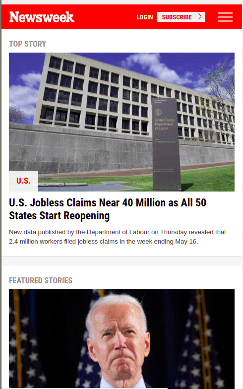
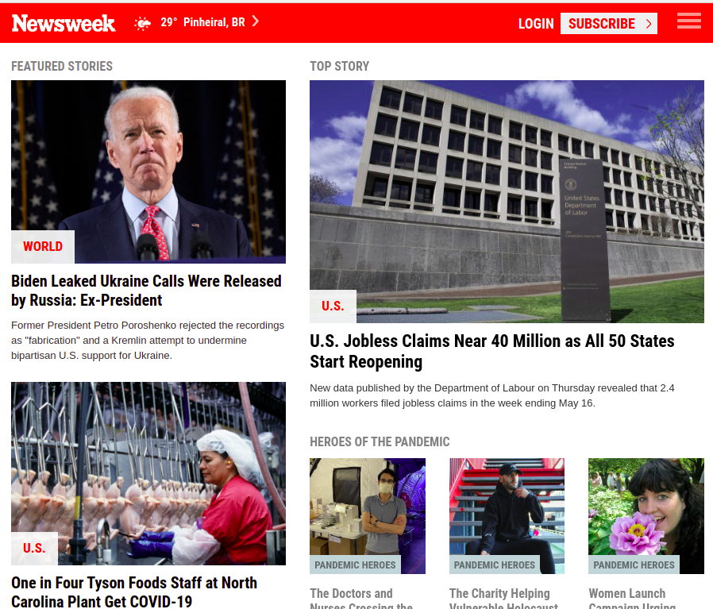
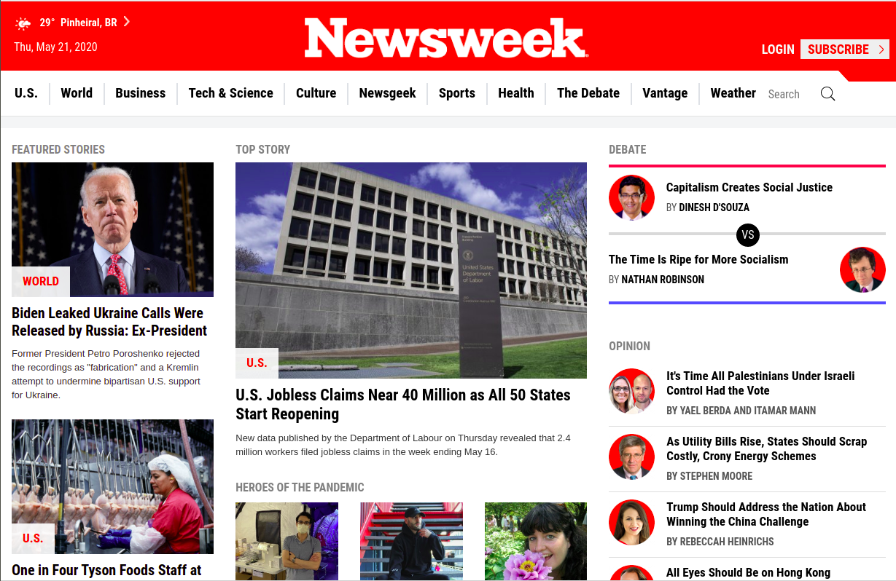

# NewsWeek Copy Page- Responsive Design and CSS Frameworks

> This project is a fully responsive replica from the NewsWeek Page. It was developed using HTML5, CSS3 and Bootstrap Framework.

This project requests to build a replica of the news site Newsweek.com using the Bootstrap framework.

The goal is to develop a responsive page using the popular framework Bootstrap. The page is a copy of the [NewsWeek](https://www.newsweek.com/) page, that is also Bootstrap based.

Warning: The original page is dinamic, the content displayed in the copy is relative to: 21/05/2020

## Mobile ScreenShot

## Medium Screen ScreenShot

## Desktop ScreenShot

## Built With

- CSS and HTML

## Live Demo

[Live Demo Link](https://marilenaroque.github.io/newsWeek-bootstrap/)

## Authors

👤 **Marilena Roque**

- Github: [MarilenaRoque](https://github.com/MarilenaRoque)
- Twitter: [@MariRoq88285995](https://twitter.com/MariRoq88285995)
- Linkedin: [roquemarilena](https://www.linkedin.com/in/roquemarilena/)

## 🤝 Contributing

Contributions, issues and feature requests are welcome!

Feel free to check the [issues page](issues/).

## Show your support

Give a ⭐️ if you like this project!

